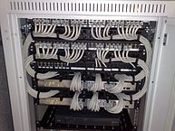

# bits
A *bit* is the smallest unit of data in computers - it can have only one of two
possible values - on or off, true or false, 1 or 0, etc. Another word for it 
is *binary digit*.

# byte
A set of 8 bits makes a byte.

# DHCP
Stands for *dynamic host configuration protocol*. A set of standards and computer 
services which is used to configure computers and servers when they start up. 
DHCP is mostly used to provide an address to a computer when it is connecting 
to the network, without it, users or administrators would have to manually given 
an address to each computer.

# DMZ
Stands for *demilitarized-zone*. A portion of a computer network which sits 
between a secure/trusted and insecure/untrusted network – for example, between 
an internal corporate network and the Internet. An email server is an example 
of a server which would be connected to the DMZ network such that it can be 
reached from inside the corporate network as well as receive and send emails 
with the rest of the Internet. Typically, a firewall protects the inside network 
from the DMZ and another firewall protects the DMZ from the Internet.

# DNS
Stands for *domain name system*. A computer system which makes it possible to 
access computers and servers using friendly names instead of network address. 
For example, `google.com` instead of `74.125.196.139`.

## fiber optic
A type of cable made of glass through which light is transmitted. Computer data 
is converted into light signals which go through the fiber optic cables. This 
method of transmitting computer data can be used over long distance at 
ultra-fast speed (speed of light).

A typical fiber optic cable is made of multiple layers - two layers carrying
the light signal (a core and a surrounding layer which confines the light to 
the core), and two layers of protection. In total, the size of a typical fiber 
optic cable (also called *strand*) is 780 micrometre (or 0.03042 inch).

> The concept for transmitting light in such a way was first publicly 
> demonstrated using a water flow carrying light in 1870.[^2]

## firewall
A network device that is installed between two networks and provide security 
features by inspecting the data sent from one network to the other and allows or 
denies the traffic based on a set of rules configured by the administrator. It 
is similar to a router but performs more security functions by inspecting the 
traffic, not only routing it. It is typically used between the Internet and a 
corporate network to prevent malicious intrusions from the Internet onto the 
internal network.

# hexadecimal
A number system with base 16 (meaning there are 16 values). The symbols used 
are: 0, 1, 2, 3, 4, 5, 6, 7, 8, 9, A, B, C, D, E, F. Hexadecimals are widely
used in computing because binaries are harder for humans to deal with. The 
decimal number `42`, when represented in hexadecimal is `2A` - usually written 
with the prefix `0x` to signify hexadecimal (`0x2A`). 
`2A = (2 * 161) + (10 x 160) = 42`.

# IEEE
Institute of Electrical and Electronics Engineers - a professional association
which has the purpose of educating and advancing the field of electrical and 
electronic engineering, telecomunications, computer engineering and other 
related fields.

# micrometre
The micrometre is also known as micron. It is one millionth of a meter, or 
0.001 mm - about 0.000039 inch.

## modem
*MOdulator DEModulator* - a device which encodes dinary data (digital) into an 
analog signal suitable to be transmitted between devices. For example, modems
were used to connect computers via phone lines. Modems are still used today - 
for example, to connect mobile computers (such as smartphones) to computer 
networks via cellular signal.

# NTP
Stands for *network time protocol*. A set of standards and computer services 
which are used to synchronize the clock of computers against reliable clocks. 
Without this, computers wouldn’t be able to maintain an accurate time as they 
would drift over time, just like most watches do.

## patch cable
A (normally) short cable used to connect two devices together or to connect a 
device to a patch panel or wall outlet. Patch cables are normally made of a 
different type of wire (stranded - multiple small strand of coper wires) than 
the cables that run through the walls (solid - a single and thicker strand of 
coper wire). Due to its material, there is more signal loss on a patch cable,
in favor of its flexibility. For this reason, it is best to keep patch cable
relatively short.

## patch panel 
A patch basically mean to connect two things together. A patch panel is a where
the cables coming from the wall outlets through the walls, are connected. The
cables are attached to the back of a connector attached to the patch panel. The
front is a standard network cable connector which is used to connect a cable
between the patch panel and the switch port (or other device).

<small>By Dsimic - Own work, CC BY-SA 4.0, 
https://commons.wikimedia.org/w/index.php?curid=42202271</small>

# redundancy
In engineering, redundancy is the duplication of critical components or 
functions of a system with the intention of increasing reliability of the 
system, usually in the form of a backup or fail-safe.

# resiliency
The capacity to recover quickly from difficulties, the ability to avoid or 
reduce the impact of problems to avoid complete failure. A system is resilient 
if it is still usable when some of its parts are not working. 

# UPS
Stands for *uninterruptible power supply*. A device which has batteries and 
regulates the power, preventing computers to stop during a power outage or power 
fluctuations.

