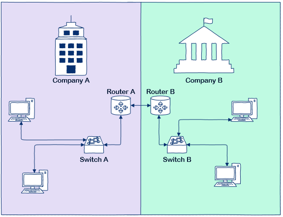
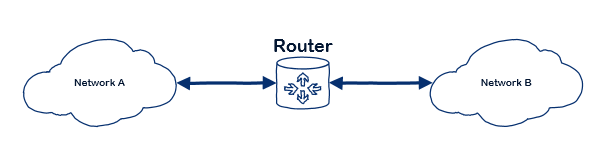
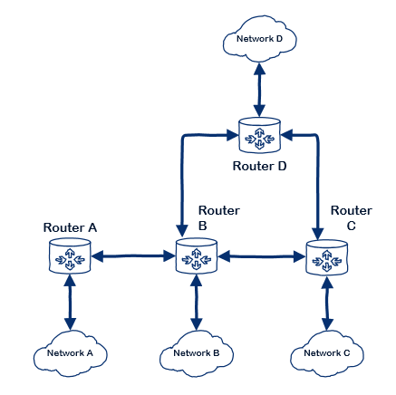

Routing
====================================

In switching, we covered how data travels between computers within the same 
network. That's useful, but most network today are inter-connected with another
network - so there must be a way to transfer information between two different
network - that's the job of the *router* and the action is *routing*.



Before getting into how routers work, let's first review what is meant by "a 
network". Here we are going to cover networks based on the Internet Protocol 
(IP networks) only. There are other types of networks but today, the typical 
network encountered is the IP network and other types are only used in 
specialized fields.

In the IP-based routing sense, a network is a set of devices connected with 
switches with all devices in the same IP address range. This would be more 
appropriately called a subnetwork (subnet for short), however the term network 
is, more often than not, used to describe such an installation.

A network is identified by a combination of an IP address and a *mask*. A mask 
(or network mask, shortened to *netmask*, when applied to networking) is a 
concept of binary mathematics (a simple explanation of binary mathematics 
follows). The mask defines the IP addresses available within the network and 
enables the computer to determine, when attempting to communicate to another 
device, whether the destination is within the same network or not. Binary 
mathematics are important to routing as this is how everything is calculated.

If the device is in the same network, the packet is simply handed off to the
switch to forward. But if it is not on the same network, the computer tells the
switch to send the packet to the device defined in its network configuration as
the *gateway* (the router).

## Binary mathematics - a simple view
To humans, IP addresses are 4 sets of 1 to 3 decimal numbers separated by dots, 
example: `192.168.1.5` (called dotted-decimals). But to computers, this is just 
a series of 0s and 1s, example: `11000000101010000000000100000101`.

In binary mathematics, the value of a `1` is determined by its position. This is 
very similar to decimals. In the decimal number `1234` - we know that the `1`
is in the *thousands* position, the `2` is in the *hundreds*, the `3` in the
*tens* and finally, the `4` is in the *ones* position. Then one simply 
multiplies the position's value with the corresponding digit (e.g. `2 x 100`).

So with binaries, we have only two digits possible in each positions - 0 or 1 -
which makes it actually a little bit simpler than decimals. The difference is 
in the value of the positions. Instead of being *ones*, *tens*, *hundreds*, etc,
binary numbers use powers of 2 (binary = two). Hence, the first position (the 
right-most) is 2<sup>0</sup>, then 2<sup>1</sup>, 2<sup>2</sup>, and so on. Or, 
in simple decimal numbers: 1, 2, 4, 8, 16, 32, etc.

To illustrate this, let's convert the decimal number `42` into binary:

 | Position: |  6  |  5  |  4  |  3  |  2  |  1  |
 | --------- | --: | --: | --: | --: | --: | --: |
 | Value:    | 32  | 16  |  8  |  4  |  2  |  1  |
 | Binary:   |  1  |  0  |  1  |  0  |  1  |  0  |

Let's add this up - we can ignore any positions which have a zero in them as 
obviously *0 times anything equals 0*. So we have: `2 + 8 + 32 = 42`. The
binary representation of decimal `42` is `101010`.

How does all this relates to routing? Computers, to determine whether two IP
addresses are in the same network or not use a *mask*. A mask is a Boolean
algebra concept related to binary values.

Boolean algebra is a branch of mathematics which deals with logics.

> Boolean algebra was invented by George Boole in 1847 (but he didn't call it 
> such). It took until the 1930s for someone (Claude Shannon) to realize that 
> Boolean algebra could be used with electronics. This is what forms the
> basis of all computers today.

In Boolean algebra, the values are only one of two possibilities - 0 or 1 (false
or true). The basic operations are: AND, OR and NOT. These operations define 
the result of joinning two binary numbers (terms) together (in the case of NOT, 
it is applied to a single term). 

 * *AND*: Both terms must be true (1) to get a result of true. E.g.: 1 AND 0 = 0, 
   1 AND 1 = 1, 0 AND 0 = 0.
 * *OR*: At least one of the terms must be true to get a result of true. E.g.:
   1 OR 0 = 1, 0 OR 0 = 0, 1 OR 1 = 1.
 * *NOT*: Inverts the term - if the term is true, the result is false, if the 
   term is false, the result is true. E.g.: NOT 1 = 0, NOT 0 = 1.

> There are more Boolean operations but they will not be explained here.

With this in mind, a mask is simply an AND operation against two binary numbers
(in the case of networking, the IP address and the *netmask*). Let's look at 
a simple example:

```
    0101  (value)
AND 0011  (mask)
--------
  = 0001  (result)
```

## Determining if an IP address is part of the network
Now that we have basic Boolean algebra covered, we can see how the computer
determines whether the destiation of a packet is on the name network or not.

The two datums available are IP address and netmask - this is entered into the
computer by the person configuring it. Let's use `192.168.1.5` as IP address
and `255.255.255.0` as network mask.

The first action to be done is calculating the prefix - the first IP address
in the range, also called the *network* (yes, another way of using this same 
word). To do this, we will use the *AND* boolean operator.

```
    11000000.10101000.00000001.00000101  (192.168.1.5 - IP address)
AND 11111111.11111111.11111111.00000000  (255.255.255.0 - Netmask)
    -----------------------------------
  = 11000000.10101000.00000001.00000000  (192.168.1.0 - Prefix)
```

> The computer does not places dots (.) between parts, it simply knows that
> they are grouped in sets of 8. We put the dots to make it easier to read.
 
The above example would be called the `192.168.1.0` network. The netmask 
in decimal notation is `255.255.255.0`, however there is another notation which
network engineers like to use which is refered to as the *slash notation*, in 
this case, it's `/24`. So the network would be written as `192.168.1.0/24`.
To all network engineers, this single statement - `192.168.1.5/24` - tells them 
almost all they want to know about the network configuration and is easier 
than saying "my IP address is `192.168.1.5` and the netmask is `255.255.255.0`".

To calculate the *slash notation*, one can simple count how many 1s there are
in the binary representation of the netmask - `11111111.11111111.11111111` 
in the preceeding example.

The binary format of a network mask also tells us what digits to take from the 
IP address to find the host part of the address (that is, the identifier which 
is unique to the computer on this network). To do that, simply locate the last 
consecutive series of 0s in the netmask - in the example above, it's 8 zeroes 
(`00000000`). Thus, the portion of the IP address in the same position as this
block is the host - in this case, it's `00000101` or `5`.

There is one more datum we need to be able to determine if a packet is to be 
handed off to the switch to deal with, or forwarded to the router (gateway).
We need to determine if the destination address is within the same network 
or not.

To do that, we can simply apply the netmask to the destination address so as to
extract the network prefix. If we get the same value as the prefix for the
computer, then it is on the same network. 

For this example, let's assume the user is doing a `ping` to a computer with 
the IP address of `192.168.22.45`. Let's apply the netmask of our computer 
against this IP address:

```
    11000000.10101000.00010110.00101101  (192.168.22.45 - IP address)
AND 11111111.11111111.11111111.00000000  (255.255.255.0 - Netmask)
    -----------------------------------
  = 11000000.10101000.00010110.00000000  (192.168.22.0 - Prefix)
```

Finally, let's compare the prefix gotten to the prefix we got with the IP 
address of our computer earlier: `192.168.22.0` is not equal to `192.168.1.0`.

Or in binary with Boolean logic, we compare the two prefix using the 
Exclusive-OR operator (not covered earlier, the Exclusive-OR or XOR gives a 
result of true when both terms are different, and a result of false when
they are identical). If we get all 0s, then the two prefix are equal and 
therefore, are in the same network.

```
    11000000.10101000.00010110.00000000  (Destination prefix - 192.168.22.0)
XOR 11000000.10101000.00000001.00000000  (Local computer prefix - 192.168.1.0)
    -----------------------------------
  = 00000000.00000000.00010111.00000000
```

## So, what does the router do?
We have now covered how the computer determines whether to send the packet 
to the switch to be forwarded, or to tell the switch to forward the packet to
the gateway. With this knowledge, we can move further in understanding how the
router performs its work - routing packets between networks.

To work, a router must be connected to the various networks it is meant to 
route computer data to. A simple router will have two network ports so that it
can be connected to two networks and route traffic between both. More advanced
routers have multiple ports.



The router also has an IP address which is part of each network. For example,
let's take two networks: A: `192.168.1.0/24` and B: `192.168.22.0/24`. The router
is connected via Port 1 to network A and the IP address `192.168.1.1` is assigned
to Port 1. Port 2 is connected to network B and the IP address assigned to 
Port 2 is `192.168.22.1`.

When configuring computers on network A, the administrator would then enter
`192.168.1.1` as the gateway address. And on network B, `192.168.22.1`.

When a computer on network A (with IP address `192.168.1.5`) sends a packet to
a computer on network B (with IP address `192.168.22.45`), the packet is sent
to the `192.168.1.1` address - the router. The router looks up the destination
(`192.168.22.45`) and sees that it matches the other network it is connected to,
so routes the packet to Port 2 to be forwarded on that network.

That is the simplicity of routers.

## Networks aren't only between companies
In the examples earlier, we gave the example of two networks, one for Company A
and the other for Company B. But subnets aren't only constraint to being in
different company.

A single company could use multiple networks to isolate various areas. For 
example, a Human Resources department has information on its computers which
is more sensitive such as payroll, so it is a good candidate to be on a 
separate network.

When a network becomes large, the broadcasts that occurs when a computer tries
to send information become numerous and can create a lot of traffic on a network.
Imaging if there are 1,000 computers on a single network. Everytime a computer 
needs to discover a new device, a broadcast is sent to 999 other computers.

## Why having two types of devices?
That is a good question. If that is all routers did, it would definitely look
extravagant to purchase a router just to do that. 

Instead, one could configure the network to be *larger* (i.e. `192.168.1.0` 
through `192.168.22.255` to reuse the earlier examples) so that all computers 
are on the same network. That would definitely work and in fact, many small
organizations simply do that.

But there are other functions a router can do - for example, it can filter the
traffic, allowing only certain types of transmissions such as email, web 
browsing, phone calls, etc. While a router does not have the ability to look
at the data inside the packets it routes, it is able to tell what type of packets
they are (what protocol). Routers can also allow traffic based on IP addresses -
for example, allowing user computers to access only certain servers in the servers
subnet.

Routers have other capabilities such as encryption - traffic can be encrypted
for security when transmitting the data between two routers. This is common
when two routers are not directly connected but are rather communicating via 
the Internet or via a wireless connection.

Today, there are also switches which also performs the basic router functions
(routing packets and filtering based on IP address). In this case, the switch
isn't really a switch in its full sense and isn't really a router either. It's
both and is commonly refered to as *Layer 3 switch*.

> Layer 3 refers to the 7 distincts functionalities on a network, layer 3 is
> the routing layer.

## A more complex network
The Internet is a complex network made of multiple networks inter-connected 
to each other with routers. Larger corporations have more complex networks
as well - for example, a company with a campus of multiple building might
define each building as its own network and inter-connect them.

This would look a little bit like the following diagram:



In the above diagram, it is interesting to note that Network A is able to 
connect to computers in Network B because the routers of Network A and B are
directly connected, but (provided the network administrator allows it), Network
A is also able to connect to computers in Networks C and D via Router B.

This inter-connection is what makes the Internet a resilient network. Each 
networks are connected to one or more networks. A network with connections to
multiple other networks has more chances to reach its destination when there 
are outages.

In fact, the Internet Protocol which defines how this kind of network works, was
designed originally as a military communication system that could never be 
taken down by the loss of a city that serves as relay point.

## Recap
Routers are the key to transmitting information between different networks. They
provide fundamental network security and by inter-connecting multiple networks,
we can create a resilient network.

