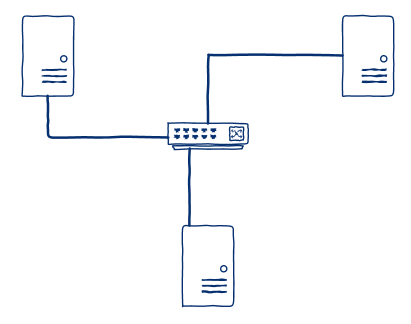
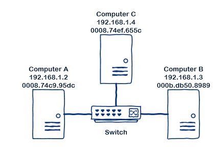
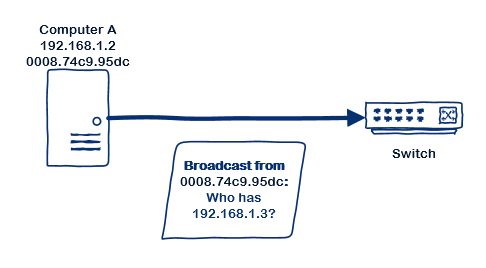
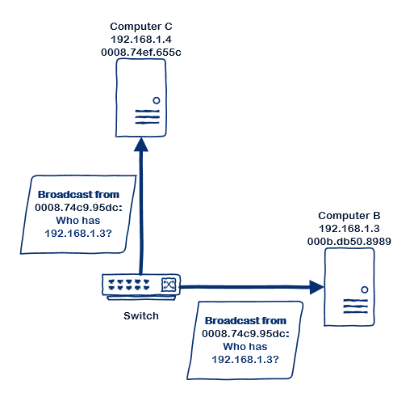
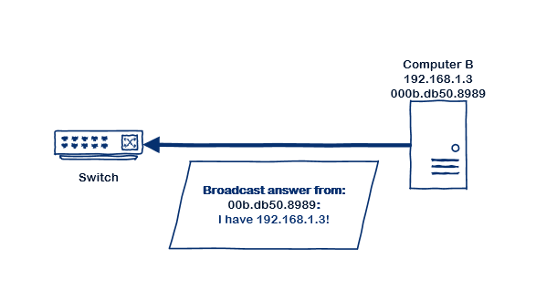
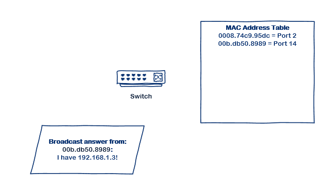
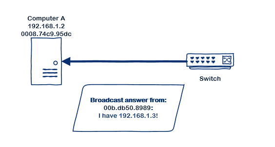
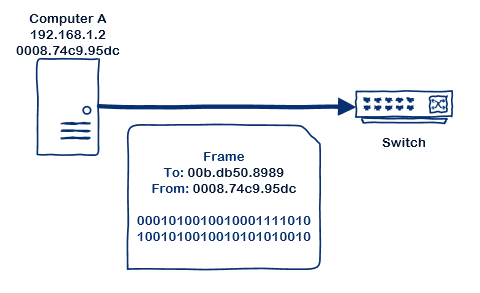
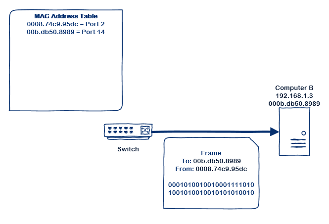

Switching
====================================

A network begins with connecting two or more computers or devices to a switch.
The computers send packets of data to the switch and in turns, it sends the
packets to the recipient. So how does switching works?

While there are many types of networks, what we will cover here is the most
typical - the Ethernet switch.

## What is a switch?
Probably the most common piece of equipment encountered relating to networking 
is the *switch*. Switches are at the core of the network - they inter-connect 
computers to each other. 

One can connect two computers together using a single network cable connecting 
the two directly. But to add a third computer (or more), one has to have a 
switch which will receive the data from `computer A` and pass it on to either
`computer B` or `computer C`.

A switch is a relatively simple network device - it does not really know anything
about what data is being sent on the network. It receives unit of data (called
*frames*) from a device connected to one of its ports, reads the destination at 
the begining of each frames and forwards (switches) the frames to the port where 
the destination device is connected.

> Most of the time, when people talk about data going over the network, the word
> packet is used. This is correct - a file sent over the network for example is
> broken up into several packets. However, between the computer and the switch,
> and between switches, the packets are put into a *frame*.

### What is in a frame?
A frame is simply a set of information encoded in a specific sequence which can
then be sent through a computer network. We can make a visual representation of
a frame with a table:

| Frame field          | Description                                           |
| -------------------- | ----------------------------------------------------- |
| Preamble             | Some codes used to synchronize the devices            |
| Destination Address  | The address of the device this frame is to be sent to |
| Source Address       | The address which sent the frame                      |
| Frame Type/Lenght    | The lenght of the frame or its type                   |
| Data (packet)        | The data being sent - the packet                      |
| Check Sequence       | A number derived from the above to verify the frame is complete |

### The MAC address
A *media access control (MAC) address* - also called physical address or hardware
address - is a unique identifier for a network device.

When manufacturers produce a device with networking capability, they create a 
unique identifier which is made of their registered number, followed by a 
sequential number for each device made.

The numbering is normally written as six groups of two hexadecimal digits, 
separated by hyphens or colons. The first six digits represent the manufacturer 
and the last six, the device within the manufacturer.

For example: `10:40:f3:f1:0a:a4` - `10:40:f3` represents Apple. The whole 
address represents in this case an MacBook laptop. Nothing in this address
give information that it is a MacBook laptop, the only thing that can be learned
from a MAC address is the manufacturer.

In theory, the MAC address is unique for every device and therefore accurately
identifies a device. However, with this scheme, there is a potential for a total
of 281,474,976,710,656 devices, if every manufacturers use every single one of 
their assigned numbers. So in reality, there will eventually be an overlap.

Moreover, it is very easy to fake a MAC address. Therefore, security through
MAC address (deciding to allow a device on the network or not based on its MAC
address) is far from a strong security. But it is a good starting point to a 
secure network.

### How a switch switches
To fully understand network switches, it is important to understand how it 
performs its function.

It all starts when a device is first connected to a port on the switch. As the
device sends data, the switch learns the MAC address of the device (by reading 
the source field of the frames) and records it in its memory called MAC address
table.

The *MAC address table* would look like this:

| MAC Address         | Port    |
| ------------------- | ------- |
|  0008.74c9.95dc     |     2   |
|  0008.74ef.655c     |     13  |
|  000b.db50.8989     |     14  |
|  001e.4ff3.b9e9     |     18  |
|  0021.b751.7652     |     19  |
|  18a9.056b.dc4d     |     10  |
|  24be.05ee.a168     |     12  |
|  38ea.a768.e8b2     |     20  |
|  9c8e.99c6.da3b     |     8   |
|  9c8e.99cc.2ac4     |     6   |
|  9c8e.99e0.9583     |     1   |
|  0060.b90b.06d1     |     16  |
|  0060.b90b.0789     |     15  |
|  0060.b90b.0a1d     |     14  |
|  0060.b950.7753     |     1   |
|  0060.b950.7765     |     13  |
|  0060.b950.824a     |     2   |
|  8418.3a2b.69c0     |     23  |
|  8418.3a2b.b590     |     22  |
|  c401.7c29.dfc0     |     21  |

Then, the switch reads the destination address of the frame. If the destination
is already in its MAC address table, it simply passes that frame to the 
corresponding port. If it isn't, the switch has to send a *broadcast* -
a specially crafted frame - asking all the devices connected whether or not
they are the destination being looked for. If a device respond, the switch 
records the port it is connected to in its MAC address table and passes the 
frame to that port. If there is no response to the broadcast, then the frame 
will not go anywhere.

### What about IP addresses?
Maybe you never heard of MAC addresses before, but you probably *know* that 
information, on a computer network, is routed to the recipient computer based 
on its IP address. Your IT staff will have explained to you many times how the 
IP address is like the postal address of a computer. So, the above might seem 
confusing and contrary to this knowledge.

That the IP address is like the postal address of a computer isn't actually 
wrong. But a postal address does not specify where your *mailbox* is. Is it at 
your door? At the corner of a street? Or a box in the car entrance near the 
street?

As a person writing a letter, you do not need to know where the mailbox is 
situated - your write the postal address on the envelop and put it in the mail.
The sorting center at your city decides whether it is for within the city or to
another city. If it is within the city, it gives it to the postman otherwise,
the mail is forwarded to another sorting center until it reaches the city of 
destination and is given to the postman.

The postman then travels the roads and delivers the mail - but what did the 
postman do? He learned, through time, where the mailboxes are located. He knows 
whether your mailbox is on the corner of the street or if it attached to the 
wall next to the door.

If the postman had enough time when he picks up your outgoing mail, he could 
look at the envelops you are sending to see if there are any going to other 
people on his delivery route. If so, he would keep them aside so he can deliver 
them immediately without giving them to the sorting center.

This is what a switch does. It passes data between computers which are directly
connected to it. *Note that there is also a possible scenario of multiple 
switches connected to each other - we will cover that later.*

When your computer sends a piece of information on the network, to another 
computer, it first sends a broadcast asking "who has IP address 
`xxx.xxx.xxx.xxx`". Every computer on the network receives the broadcast and 
the one with the IP address being asked about answers back with it's MAC 
address.

## The switch in action
Here is a visual representation of the steps covered earlier, when a user
performs a *ping* (*ping* is a program which sends a few packets of information
to another computer to see if it responds and how long it takes - similar to a
sonar in a submarine).

### Network layout

### Step 1
`Computer A: ping 192.168.1.3` - the computer sends a broadcast to find out
who has IP address `192.168.1.3`.

### Step 2
The switch records the source MAC address of the broadcast in its MAC address
table for future reference.

### Step 3
The switch forwards the broadcast to all connected devices (except the 
origin of the broadcast).

### Step 4
The device with the given IP address responds to the broadcast.

### Step 5
The switch records the MAC address of the broadcast response in its MAC 
address table for future reference.

### Step 6
The switch forwards the broadcast answer to the device which sent the broadcast
in the first place.

### Step 7
Computer A can now send the `ping` packet. The packet is included within a frame
and the frame is given to the switch.

### Step 8
The switch knows where the frame goes as it has the MAC address in its MAC 
address table - so it simply forwards the frame to the right port.

## Recap
So in summary, switching is about moving frames (which contains packets) between
hosts on a local network (i.e. between switches).

### Not all switches are equal
There are many manufacturers of switches and many grades as well. You can get at
local electronic store home-grade switches which can handle a certain amount
of concurrent traffic and have a lower degree of reliability. There are also 
more advanced switches that offer various features that are useful for 
enterprises with a larger network. 

Here are various features or differences one can look for in switches:

 * Speed at which the switch processes traffic.
 * Speed of each ports.

> These two points are actually important. For example, a cheap switch might be 
> advertized as a Gigabit switch - meaning it has ports that allow transferring 
> up to 1 Gigabit per second (Gbps). However, if the internal switch speed is 
> 2 Gbps, and the switch has 8 Gigabit ports, then you will not be able to get 
> all 8 ports going at full speed at the same time. The maximum of 2 Gbps has to
> be shared amongst all 8 ports (if all 8 ports are activelly transferring).

 * Warranty, expected lifetime.
 * Number of ports.
 * Amount of memory for storing the MAC address table.
 * Security.
 * Switch administration.
 * Monitoring.
 * Quality of Service - a feature allowing prioritization of some 
   traffic to guanrantee fast delivery (typically used for phone traffic over
   the network).
 * Power-over-ethernet (capability of providing electrical power to connected
   devices, such as a phone).
 * Loop prevention.

Regardless of all this, all switches performs the same basic actions. 

